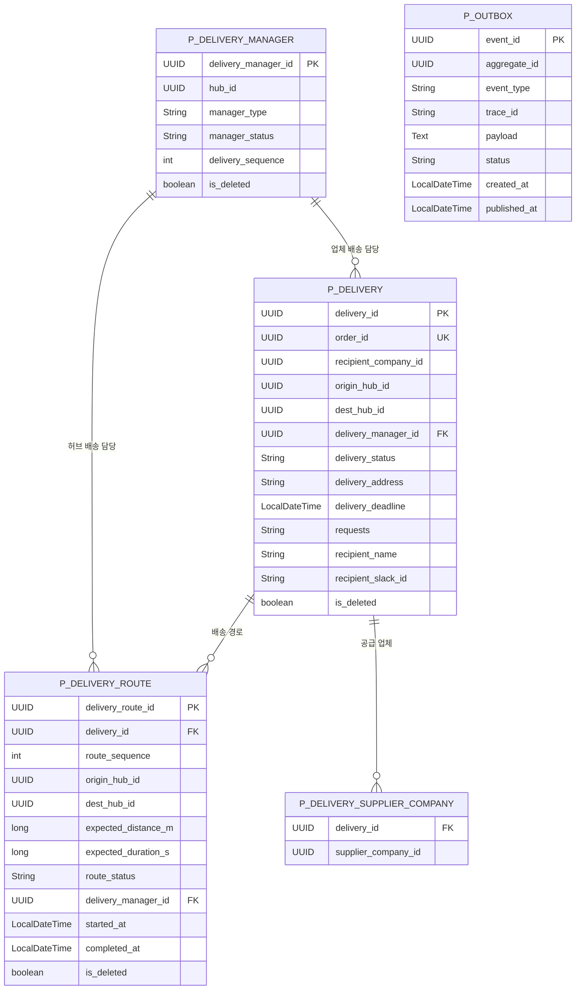

# 🚚 Delivery Service

주문 확정 이후 배송과 허브 간 배송경로를 생성하고, 배송 상태·배송경로·배송 담당자를 관리하는 서비스입니다.

Order Service의 주문 생성 이벤트를 소비하고 User·Company·Hub Service의 내부 API를 호출하여 배송에 필요한 정보를 구성합니다. 배송 생성 결과는 Transactional Outbox Pattern을 통해 Kafka 이벤트로 발행합니다.

## 📌 기본 정보

| 항목 | 내용 |
| --- | --- |
| 서비스명 | `delivery-service` |
| 포트 | `19097` |
| 데이터베이스 | PostgreSQL |
| 스키마 | `delivery_schema` |
| 동기 통신 | OpenFeign |
| 비동기 통신 | Kafka |
| 서비스 디스커버리 | Eureka |
| 이벤트 발행 | Transactional Outbox |
| API 문서 | Springdoc OpenAPI·Swagger UI |
| 분산 추적 | Micrometer Tracing·Zipkin |

## ✨ 주요 기능

### 배송

- `order.created` 이벤트 기반 배송 자동 생성
- 생성 결과에 따른 `delivery.created`·`delivery.creation.failed` 이벤트 발행
- 배송 단건·목록 검색 및 추적 상세 조회
- 배송 정보·상태·업체 배송 담당자 수정
- 배송과 배송경로 Soft Delete
- 주문 ID를 이용한 중복 이벤트 처리 방지

### 배송경로

- `order.created` 처리 중 Hub Service에서 조회한 최적 허브 경로 기반 자동 생성
- 배송경로 단건 조회 및 조건별 목록 검색
- 배송경로 상태 변경 및 상위 배송 상태 자동 변경
- 허브 배송 담당자 배정 및 변경

### 배송 담당자

- 배송 담당자 등록·단건 조회·목록 검색·수정·삭제
- `HUB_DELIVERY`·`COMPANY_DELIVERY` 유형과 소속 허브 관리
- 배송 순번 관리, 순차 자동 배정 및 그룹 변경 시 재배정
- 배송 시작·완료에 따른 담당자 상태 변경

## 🌐 배송 API

기본 경로: `/api/v1/deliveries`

| Method | 경로 | 설명 |
| --- | --- | --- |
| `GET` | `/{deliveryId}` | 배송 단건 조회 |
| `GET` | `/{deliveryId}/tracking` | 배송 및 전체 경로 추적 조회 |
| `GET` | `/` | 배송 목록 조회·검색 |
| `PATCH` | `/{deliveryId}/status` | 배송 상태 변경 |
| `PATCH` | `/{deliveryId}/manager` | 업체 배송 담당자 배정·변경 |
| `PATCH` | `/{deliveryId}` | 배송 정보 수정 |
| `DELETE` | `/{deliveryId}` | 배송 및 배송경로 Soft Delete |

배송 생성은 외부 API가 아니라 `order.created` 이벤트를 소비하여 자동으로 처리하며, 결과는 `delivery.created` 또는 `delivery.creation.failed`로 발행합니다.

## 🌐 배송경로 API

기본 경로: `/api/v1/delivery-routes`

| Method | 경로 | 설명 |
| --- | --- | --- |
| `GET` | `/{deliveryRouteId}` | 배송경로 단건 조회 |
| `GET` | `/` | 배송경로 목록 조회·검색 |
| `PATCH` | `/{deliveryRouteId}/status` | 배송경로 상태 변경 |
| `PATCH` | `/{deliveryRouteId}/manager` | 허브 배송 담당자 배정·변경 |

배송경로는 `order.created` 처리 중 Hub Service가 반환한 전체 이동 경로를 이용하여 자동으로 저장합니다.

## 🌐 배송 담당자 API

기본 경로: `/api/v1/delivery-managers`

| Method | 경로 | 설명 |
| --- | --- | --- |
| `POST` | `/` | 배송 담당자 등록 |
| `GET` | `/{deliveryManagerId}` | 배송 담당자 단건 조회 |
| `GET` | `/` | 배송 담당자 목록 조회·검색 |
| `PATCH` | `/{deliveryManagerId}` | 배송 담당자 정보 수정 |
| `DELETE` | `/{deliveryManagerId}` | 배송 담당자 Soft Delete |

## 🔒 내부 API

| Method | 경로 | 사용 목적 |
| --- | --- | --- |
| `GET` | `/api/v1/internal/deliveries?orderId={orderId}` | 주문의 배송 및 배송경로에 배정된 담당자 ID 목록 조회 |

내부 API는 배송경로 담당자와 업체 배송 담당자를 함께 조회하며, `null`과 중복 ID를 제외합니다. 담당자가 배정되지 않은 경우 오류가 아닌 빈 배열을 반환합니다.

## 🔄 배송 생성 흐름

```text
Order Service
    → order.created 발행
    → Delivery Service 이벤트 소비
    → User Service 수령인 정보 조회
    → Company Service 수령 업체의 목적지 허브 조회
    → Hub Service 출발·목적지 허브 간 경로 조회
    → 배송 및 배송경로 생성
    → 배송 담당자 순차 자동 배정
    → DeliveryCreated Outbox 저장
    → 트랜잭션 커밋
    → Outbox Publisher가 delivery.created 발행
```

배송, 배송경로 및 `DeliveryCreatedEvent` Outbox는 하나의 DB 트랜잭션에서 저장합니다.

동일한 `orderId`의 배송이 이미 존재하면 중복 이벤트로 판단하여 배송과 Outbox를 다시 생성하지 않습니다.

## 🔗 서비스 간 동기 통신

| 대상 서비스 | Method | 내부 API | 사용 목적 |
| --- | --- | --- | --- |
| User Service | `GET` | `/api/v1/internal/users/{userId}/delivery-info` | 수령인 이름·Slack ID 조회 |
| Company Service | `GET` | `/api/v1/internal/companies/hub-info?companyId={companyId}` | 수령 업체의 목적지 허브 조회 |
| Hub Service | `GET` | `/api/v1/internal/hubs/{hubId}` | 담당자 등록·수정 시 허브 검증 |
| Hub Service | `POST` | `/api/v1/internal/hub-routes/paths?searchType=OPTIMAL` | 출발 허브에서 목적지 허브까지 최적 경로 조회 |

서비스 위치는 Eureka의 서비스 이름을 통해 조회합니다.

## 📨 Kafka Event

| 구분 | Event | Topic | Partition Key | Producer | Consumer |
| --- | --- | --- | --- | --- | --- |
| 소비 | `OrderCreatedEvent` | `order.created` | Order ID | Order | Delivery |
| 발행 | `DeliveryCreatedEvent` | `delivery.created` | Delivery ID | Delivery | Order·Notification |
| 발행 | `DeliveryCreationFailedEvent` | `delivery.creation.failed` | Order ID | Delivery | Order |

발행 이벤트에는 다음 Kafka Header를 포함합니다.

| Header | 설명 |
| --- | --- |
| `event-type` | 이벤트 유형 |
| `trace-id` | 서비스 간 비즈니스 흐름 추적 ID |

## ⚠️ 배송 생성 실패 처리

`order.created` 처리 중 다음 오류가 발생하면 배송 생성을 재시도합니다.

| 실패 코드 | 설명 |
| --- | --- |
| `RECEIVER_NOT_FOUND` | 수령인 정보를 확인할 수 없음 |
| `DESTINATION_HUB_NOT_FOUND` | 목적지 허브를 확인할 수 없음 |
| `HUB_ROUTE_NOT_FOUND` | 허브 이동 경로를 확인할 수 없음 |
| `DELIVERY_SAVE_FAILED` | 배송 또는 배송경로 저장 실패 |
| `DELIVERY_CREATION_FAILED` | 분류되지 않은 배송 생성 실패 |

```text
order.created 처리 실패
    → 2초 간격 재시도
    → 재시도 3회 소진
    → DeliveryCreationFailedEvent Outbox 저장
    → delivery.creation.failed 발행
```

실패 이벤트에는 실패한 원본 이벤트 ID, 주문 ID, 실패 코드 및 실패 메시지가 포함됩니다.

## 📤 Transactional Outbox

배송 데이터와 Kafka 이벤트 간 정합성을 유지하기 위해 Transactional Outbox Pattern을 사용합니다.

```text
하나의 DB 트랜잭션
    ├─ 배송 저장
    ├─ 배송경로 저장
    └─ Outbox 저장

트랜잭션 커밋
    → PENDING Outbox 조회
    → Kafka 이벤트 발행
    → PUBLISHED 변경
```

| 설정 | 내용 |
| --- | --- |
| 조회 주기 | 이전 발행 작업 종료 후 3초 |
| 발행 대상 | `PENDING` 상태 Outbox |
| 발행 성공 | `PUBLISHED` 상태로 변경 |
| 발행 실패 | `PENDING` 상태를 유지하여 다음 주기에 재시도 |

Outbox Event 유형은 다음과 같습니다.

- `DELIVERY_CREATED`
- `DELIVERY_CREATION_FAILED`

## 🚦 배송 상태

| 상태 | 설명 |
| --- | --- |
| `HUB_WAITING` | 출발 허브에서 배송 대기 |
| `HUB_IN_TRANSIT` | 허브 간 배송 진행 |
| `DESTINATION_HUB_ARRIVED` | 목적지 허브 도착 |
| `COMPANY_DELIVERY_IN_PROGRESS` | 목적지 업체로 배송 진행 |
| `DELIVERED` | 배송 완료 |
| `CANCELLED` | 배송 취소 |
| `FAILED` | 배송 실패 |

정상적인 배송 상태 흐름은 다음과 같습니다.

```text
HUB_WAITING
    → HUB_IN_TRANSIT
    → DESTINATION_HUB_ARRIVED
    → COMPANY_DELIVERY_IN_PROGRESS
    → DELIVERED
```

첫 번째 배송경로가 이동을 시작하면 배송은 `HUB_IN_TRANSIT`으로 변경되고, 마지막 배송경로가 도착하면 배송은 `DESTINATION_HUB_ARRIVED`로 변경됩니다.

## 🛣️ 배송경로 상태

| 상태 | 설명 |
| --- | --- |
| `HUB_TRANSIT_WAITING` | 허브 이동 대기 |
| `HUB_IN_TRANSIT` | 다음 허브로 이동 중 |
| `HUB_ARRIVED` | 목적지 허브 도착 |
| `CANCELLED` | 경로 이동 취소 |
| `FAILED` | 경로 이동 실패 |

정상적인 배송경로 상태 흐름은 다음과 같습니다.

```text
HUB_TRANSIT_WAITING
    → HUB_IN_TRANSIT
    → HUB_ARRIVED
```

배송경로가 `HUB_IN_TRANSIT`으로 변경되면 `startedAt`, `HUB_ARRIVED`로 변경되면 `completedAt`을 기록합니다.

## 👷 배송 담당자 정책

### 담당자 유형

| 유형 | 허브 ID | 담당 범위 |
| --- | --- | --- |
| `HUB_DELIVERY` | 없음 | 허브 간 배송경로 |
| `COMPANY_DELIVERY` | 필수 | 해당 허브의 업체 배송 |

### 담당자 상태

| 상태 | 설명 |
| --- | --- |
| `AVAILABLE` | 배송 배정 가능 |
| `IN_DELIVERY` | 배송 진행 중 |
| `OFF_DUTY` | 근무하지 않는 상태 |

- 배송 가능한 담당자를 배송 순번에 따라 순차 배정합니다.
- 마지막 순번까지 배정한 경우 첫 번째 담당자부터 다시 배정합니다.
- 배정 가능한 담당자가 없으면 담당자를 비워둔 상태로 배송을 생성합니다.
- 배송 중인 담당자의 정보 변경은 제한합니다.
- `IN_DELIVERY` 상태를 수정 API에서 직접 지정할 수 없습니다.
- 배송 시작 시 `IN_DELIVERY`, 배송 완료 시 `AVAILABLE`로 변경합니다.

## 🔐 권한 및 동시성 정책

- Gateway에서 역할 기반 1차 인가를 수행합니다.
- Delivery Service에서 본인 배송·담당 허브·관련 업체 등 세부 비즈니스 권한을 다시 검증합니다.
- 배송 및 배송경로 상태 변경, 배송 담당자 배정, 순번 계산에 비관적 쓰기 락을 사용합니다.
- 삭제는 실제 행을 제거하지 않고 `BaseEntity`의 Soft Delete를 사용합니다.


## 🗃️ ERD

아래 ERD는 Delivery Service가 관리하는 핵심 테이블과 관계를 나타냅니다.



`p_outbox.aggregate_id`는 `DELIVERY_CREATED`에서는 배송 ID, `DELIVERY_CREATION_FAILED`에서는 주문 ID를 저장합니다. 다른 테이블과 물리적인 Foreign Key 관계를 갖지 않습니다.

배송 담당자 ID는 User Service의 사용자 ID를 사용하지만, MSA의 데이터 분리 원칙에 따라 User 테이블과 직접 Foreign Key를 연결하지 않습니다.

## 🛠️ 기술 스택

| 구분 | 기술 |
| --- | --- |
| Language | Java 21 |
| Framework | Spring Boot 3.5.16 |
| Cloud | Spring Cloud 2025.0.3 |
| Build | Gradle |
| Persistence | Spring Data JPA, Hibernate |
| Dynamic Query | QueryDSL 5.1 |
| Database | PostgreSQL |
| Messaging | Apache Kafka, Spring Kafka |
| Service Discovery | Netflix Eureka |
| Synchronous Communication | Spring Cloud OpenFeign |
| API Documentation | Springdoc OpenAPI, Swagger UI |
| Tracing | Micrometer Tracing, Brave, Zipkin |
| Validation | Jakarta Bean Validation |
| Test | JUnit 5, Mockito, AssertJ, H2, Testcontainers |

## ⚙️ 실행 환경

### 필수 인프라

- PostgreSQL
- Kafka
- Eureka Server

전체 배송 생성 흐름을 실행하려면 다음 서비스가 함께 실행되어야 합니다.

- Order Service
- User Service
- Company Service
- Hub Service
- Gateway Service

Zipkin은 분산 추적 결과를 확인할 때 실행합니다.


### 권장 실행 순서

```text
PostgreSQL·Kafka·Zipkin
    → Discovery Service
    → User·Company·Hub Service
    → Delivery Service
    → Order Service
    → Gateway Service
```

## 📖 API 문서

Delivery Service 실행 후 다음 주소에서 API 명세를 확인할 수 있습니다.

| 구분 | 주소 |
| --- | --- |
| Swagger UI | `http://localhost:19097/swagger-ui.html` |
| OpenAPI JSON | `http://localhost:19097/v3/api-docs` |

## ✅ 테스트

### 자동화 테스트

작성된 단위·통합 테스트의 주요 검증 범위는 다음과 같습니다.

- 배송·배송경로 저장 및 순번 기반 담당자 자동·순환·미배정 처리
- `order.created` 이벤트 변환·소비, Trace ID 및 중복 이벤트 처리
- User·Company·Hub OpenFeign 요청·응답 변환과 예외 처리
- 주문 ID 기준 배송·배송경로 담당자 내부 조회
- 성공·실패 이벤트 직렬화, Kafka Header 및 Partition Key
- Consumer 재시도와 Outbox 발행·상태 변경
- 비관적 락 및 PostgreSQL·Kafka Testcontainers 통합 흐름

### Postman 기반 로컬 통합 테스트

실제 Gateway와 각 서비스를 실행한 로컬 환경에서 다음 흐름을 검증했습니다.

- Access Token을 사용한 Gateway 경유 Delivery API 호출
- 주문 생성, `order.created` 소비 및 외부 서비스 OpenFeign 연동
- 배송·배송경로 생성, 담당자 자동 배정 및 `delivery.created` 발행
- 배송·추적 조회와 배송경로·배송·담당자 상태 전이
- 수령인 조회 실패 상황의 Consumer 재시도와 `delivery.creation.failed` Outbox 저장·발행

---

[⬅️ 프로젝트 메인 문서로 이동](../README.md)
